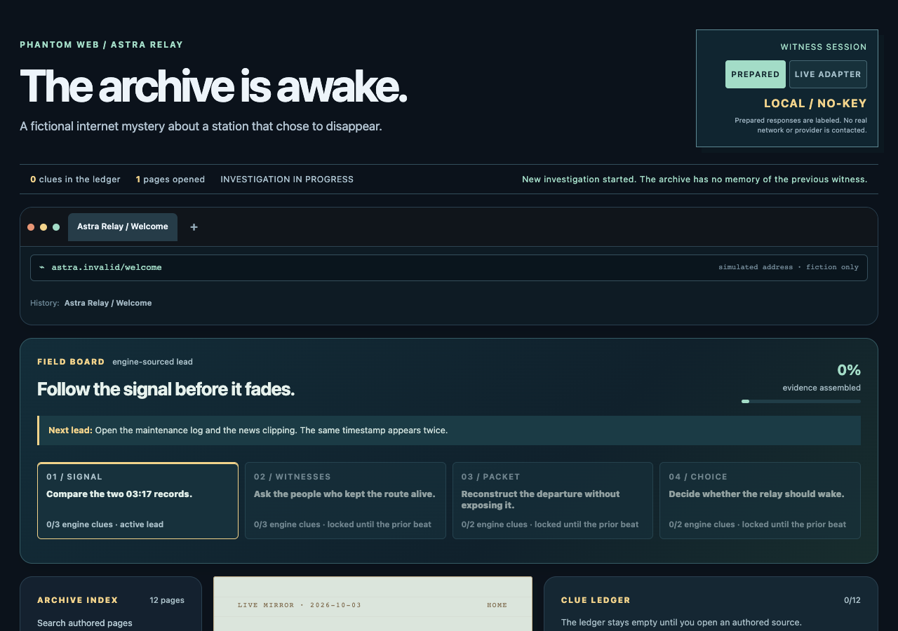
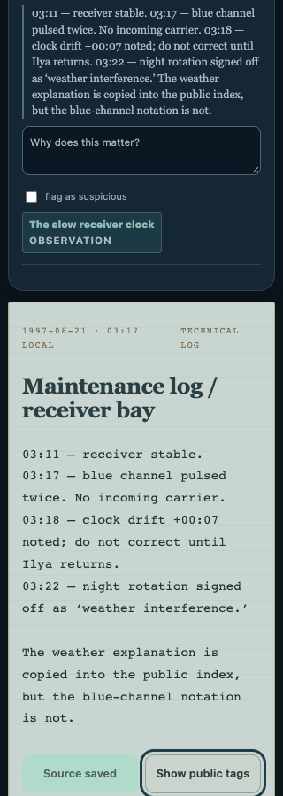

# Phantom Web

[Source repository](https://github.com/jonah-ux/phantom-web)

A fictional internet with a coherent, interactive mystery.

**Status: first prepared mystery slice is playable and the optional live adapter seam is typed. Live AI and public deployment remain unverified follow-on work.**

## What runs now

The Astra Relay story is a complete no-key investigation with twelve authored pages, a versioned canon, a dependency-checked clue graph, three witnesses, a local terminal, a hint ladder, source-linked notebook annotations, save/load, and two engine-gated endings. The interface is an app-contained fictional browser: it never contacts the real internet while you investigate.

Prepared character responses are labeled `LOCAL / NO-KEY` and cannot mutate the story outside the engine's authorized clue actions. The header also exposes `LIVE ADAPTER`; it is visibly unavailable until `VITE_PHANTOM_LIVE_ENDPOINT` points at a server route that returns the typed response envelope. No model credentials are required in the browser.



## Start locally

Use Node.js 22.12 or newer and npm. From a clean clone:

```sh
npm ci
npm run dev
```

Open http://127.0.0.1:5174. Each of the three creative projects uses a different development port.

## Checks

```sh
npm run verify
```

This runs lint, TypeScript, canon/engine checks, and the production build. CI runs the same command after a locked install. Browser acceptance is additional product proof; a build alone is not that proof.

For the repeatable browser gate, start the local app and run [`scripts/headless-acceptance.js`](scripts/headless-acceptance.js) in a named Playwright Chromium session:

```sh
npm run dev -- --port 5183
PLAYWRIGHT_CLI_SESSION=phantom-web-acceptance npx --yes --package @playwright/cli playwright-cli open http://127.0.0.1:5183/
PLAYWRIGHT_CLI_SESSION=phantom-web-acceptance npx --yes --package @playwright/cli playwright-cli run-code --filename scripts/headless-acceptance.js
```

The headless flow starts from a cleared local session, uses visible roles and text to exercise the archive, comparison terminal, witnesses, notebook, saves, hints, both endings, and the optional live fallback, then checks the 320px layout, ARIA references, reduced-motion CSS, failed requests, console errors, and page errors. It does not claim VoiceOver/NVDA behavior, other browser engines, a configured provider, or a public deployment. See [HEADLESS-ACCEPTANCE.md](docs/HEADLESS-ACCEPTANCE.md) for the evidence boundary.

## Keyboard and small screens

Press Tab on first load to reveal **Skip to investigation**. Activating it moves focus to the field board. Locked archive pages and board leads remain in the keyboard sequence so their requirements can be read; activating them explains the gate without advancing the story. Opening an available page moves focus to its heading, and the next Tab reaches its document actions.

Archive and notebook tools, investigation tools, modes, search results, and save data have accessible names or state descriptions. Focus outlines contrast with both dark panels and light document pages. The layout supports 320px-wide screens, navigation controls have at least 40px target height, and reduced-motion preferences suppress the progress animation.



The targeted acceptance pass uses Chromium keyboard interaction, accessibility-tree inspection, and viewport measurements. Spoken screen-reader announcements and Safari/Firefox behavior still require separate acceptance.

## Play the first mystery

1. Open the welcome page and the staff directory.
2. Read the maintenance log and news clipping, then open the forum and message console.
3. Run `COMPARE CLOCKS`, ask the witnesses about the triangle and blue channel, and follow the unlocked correspondence.
4. Ask Noor for corroboration or Mara for the privacy request, run `AUDIT PACKET`, and choose an ending.
5. Save a passage, add a note, reload the page, and use the notebook to return to its source.

The public source contains spoiler material in [AUTHOR-GUIDE.md](docs/AUTHOR-GUIDE.md). The main README intentionally describes the route without printing the solution.

## Architecture and boundaries

`src/canon.ts` owns the immutable Astra Relay facts, chronology, clue graph, character knowledge, disclosure gates, hints, and ending requirements. `src/corpus.json` owns the authored fictional pages and their document-level gates. `src/engine.ts` is the only writer for session progression, evidence, dialogue memory, terminal effects, hints, saves, and endings. `src/App.tsx` renders the fictional browser and prepared experience.

The engine validates every document, clue, source, prerequisite, model proposal, and imported session. A character can suggest text and a permitted clue, but cannot unlock a page, set an ending, invent a clue, or rewrite the canon. `src/live-adapter.ts` can send a bounded prompt plus discovered, character-permitted context to an optional same-origin server route; malformed, cancelled, timed-out, or unauthorized responses leave the investigation unchanged. No provider call is configured in this repository.

See [ARCHITECTURE.md](docs/ARCHITECTURE.md) for the data boundaries and [NEXT-STEPS.md](docs/NEXT-STEPS.md) for the remaining release work.

## Provenance and limits

The setting, pages, characters, and clue graph are original fictional content authored for this repository with AI assistance. The starter used the official Vite React/TypeScript template and public dependencies recorded in the lockfile. No external images, real institutions, real people, or private services are required. This project does not claim narrative quality from automated tests, live model behavior, or a deployment that has not been performed.

[MIT license](LICENSE).
